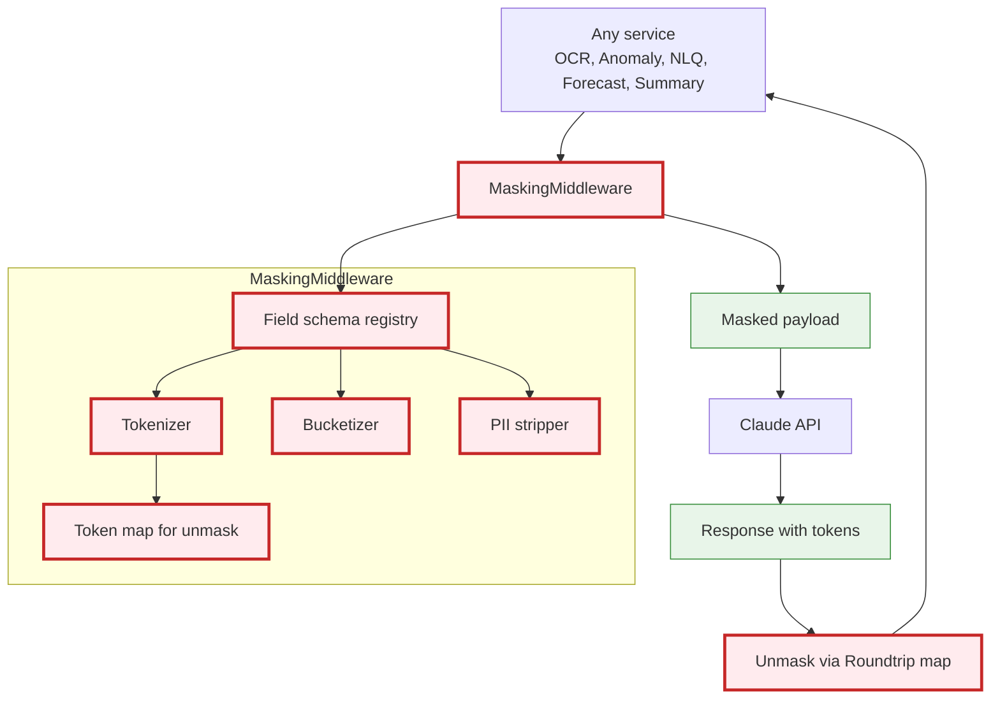
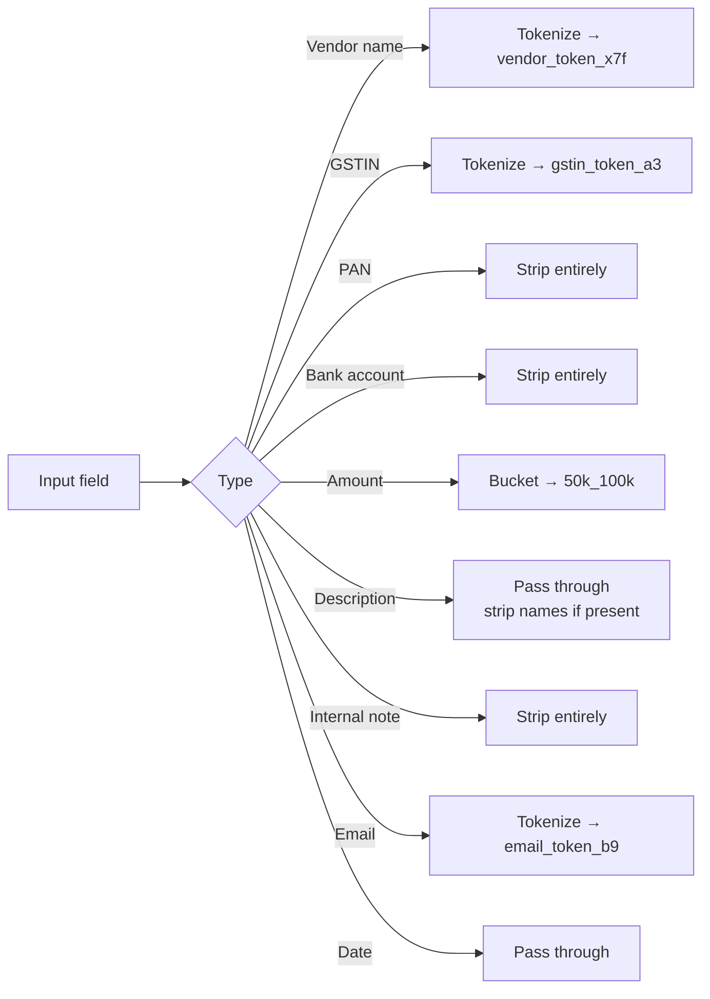
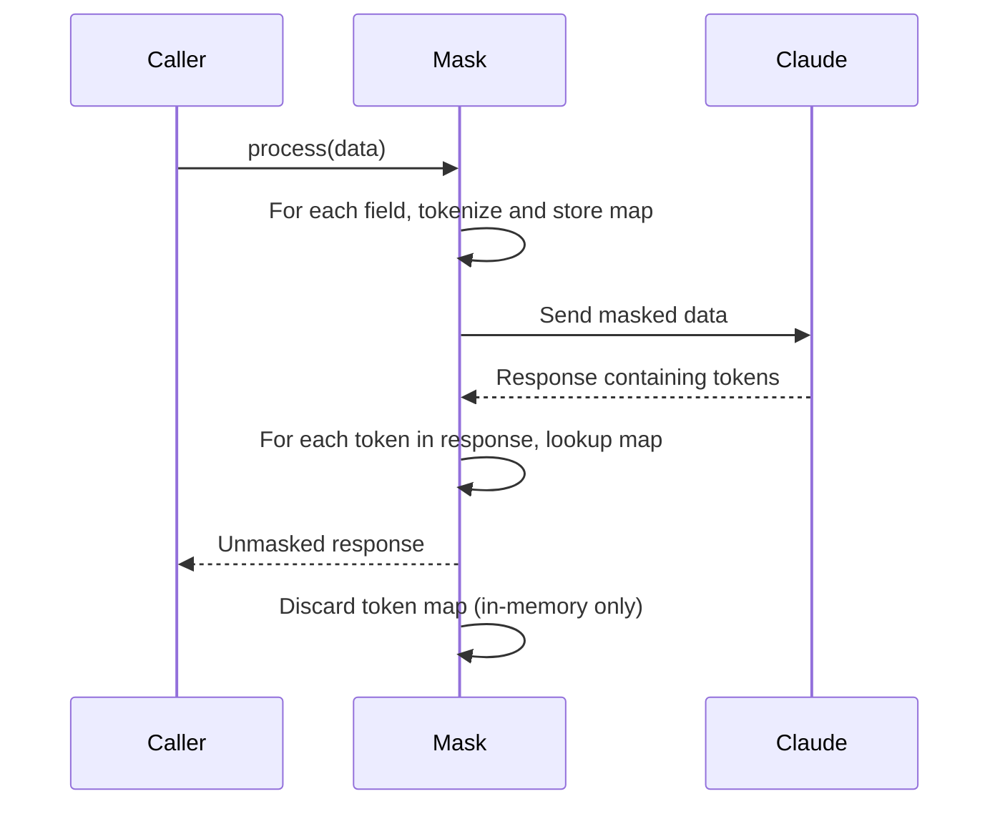

# Shared Capability — Masking Middleware

The single chokepoint for all data leaving 3SC's network bound for third-party APIs (primarily Claude). This is the ISO 27001 / SOC 2 control point.

## Architecture



## Field-Level Masking Strategy



## Token Roundtrip



The token map is **never persisted**. It exists only for the lifetime of one Claude call. Tokens are not reused across calls.

## What Gets Sent to Claude — Concrete Example

### Original (in 3SC system)
```json
{
  "vendor_name": "Acme Logistics Pvt Ltd",
  "gstin": "29ABCDE1234F1Z5",
  "amount": 247500.00,
  "description": "Transportation services Mumbai to Pune",
  "bank_account": "1234567890123",
  "submitted_by": "rahul.sharma@3sc.in"
}
```

### Sent to Claude
```json
{
  "vendor_name": "vendor_token_a8f3",
  "gstin": "gstin_token_002",
  "amount_bucket": "200k_300k",
  "description": "Transportation services Mumbai to Pune",
  "submitted_by": "user_token_004"
}
```

`bank_account` is stripped entirely. `amount` is bucketed. Names are tokenized.

### Claude's Response
```text
Anomaly score: 0.15 (low). Vendor vendor_token_a8f3 has consistent submission pattern. Amount in 200k-300k bucket aligns with prior 6 bills.
```

### Unmasked for User Display
```text
Anomaly score: 0.15 (low). Vendor Acme Logistics Pvt Ltd has consistent submission pattern. Amount in 200k-300k bucket aligns with prior 6 bills.
```

## Compliance Properties

1. **No PII leaves the network** — verified by integration tests
2. **Single chokepoint** — no service may call Claude directly
3. **Audit logged** — every Claude call logs `(caller, fields_sent, timestamp)` minus content
4. **Reviewable** — security team can grep for `claude_client.call(` and find only one place: the masking service
