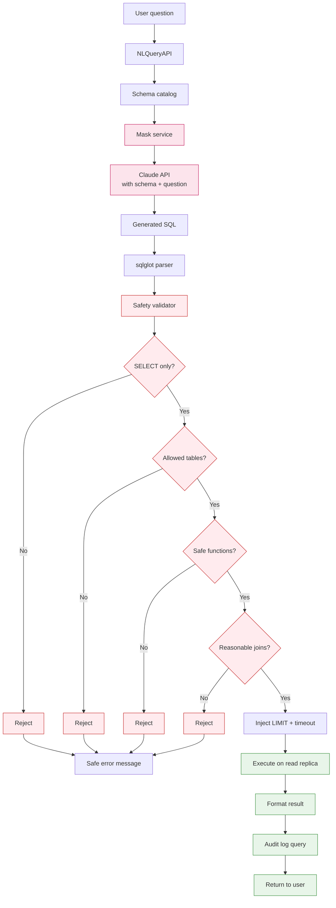

# Shared Capability — NL Query Engine

Translates natural language questions to safe SQL on the read replica.

## Architecture

## Validation Rules

| Rule | Action if violated |
|---|---|
| Statement is SELECT | Reject |
| All tables in allowlist | Reject |
| No `pg_*` system functions | Reject |
| No `lo_import`, `lo_export` | Reject |
| No `COPY` | Reject |
| Joins ≤ 5 tables | Reject |
| No subquery deeper than 4 levels | Reject |
| Result rows ≤ 10,000 (LIMIT injected) | Force limit |
| Statement timeout 30s | Force timeout |

## Allowlist of Tables

NL queries can read from but not modify:
- expenses, expense_approval_steps, expense_queries
- invoices, invoice_line_items, credit_notes, dunning_events
- budgets, budget_allocations, budget_consumption, brrs
- vendors, vendor_bank_accounts, vendor_scorecards
- ar_ledger, aging_snapshots, receipts
- ap_aging, payment_runs, msme_register
- audit_log (read-only by definition)
- forecast_snapshots, daily_projections

NL queries are **explicitly blocked** from:
- users, user_sessions (PII)
- file_refs raw paths (security)
- API keys, tokens, secrets

## Example Translations

| Question | Generated SQL Pattern |
|---|---|
| "Top 10 vendors by overdue amount" | `SELECT v.legal_name, SUM(a.balance) FROM ar_ledger a JOIN vendors v ... WHERE a.bucket != 'Current' GROUP BY v.id ORDER BY 2 DESC LIMIT 10` |
| "Bills approved by Rahul last month" | `SELECT * FROM expenses WHERE id IN (SELECT expense_id FROM expense_approval_steps WHERE actor=... AND decided_at BETWEEN ...)` |
| "Departments over 90% budget" | `SELECT d.name, b.consumed/b.allocated FROM budget_consumption b ... WHERE consumed/allocated > 0.9` |
