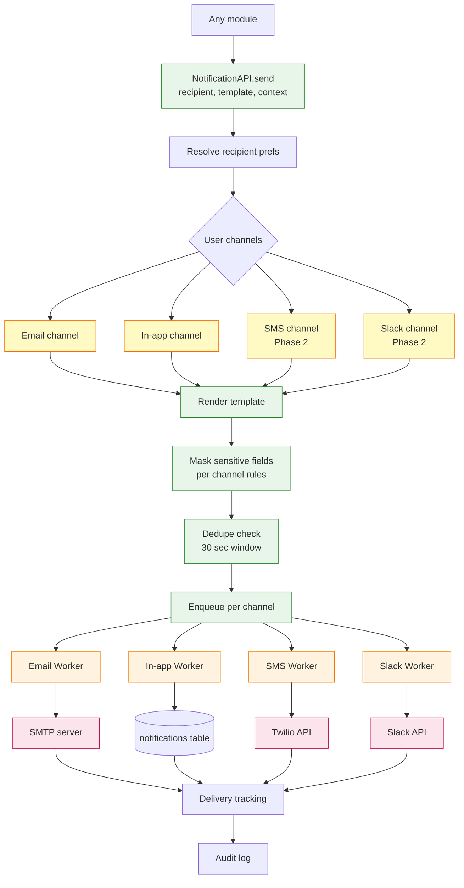
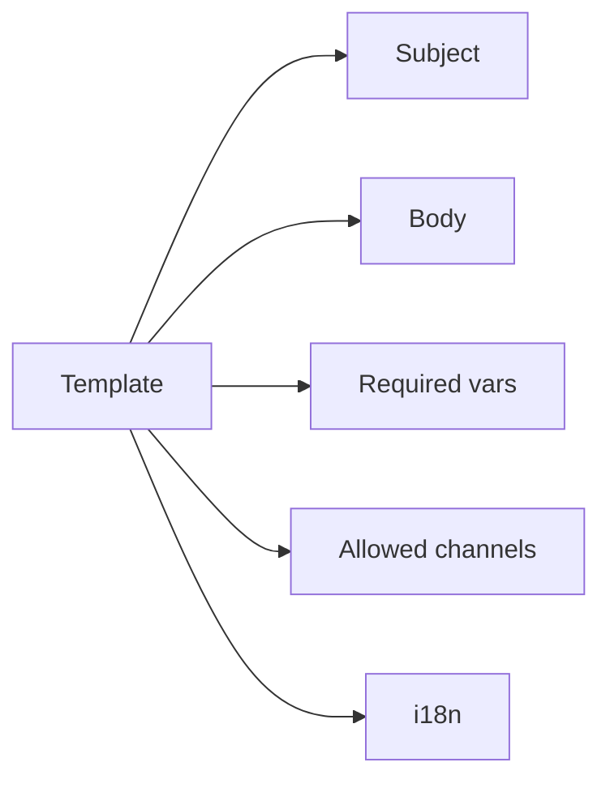

# Shared Capability — Notifications

Multi-channel notification dispatcher with templating, deduplication, and delivery tracking.

## Architecture

## Channel Per-Field Masking Rules

Different channels have different security postures:

| Field | Email | In-App | SMS | Slack |
|---|---|---|---|---|
| Vendor name | Full | Full | Initials only | Full |
| Bill amount | Full | Full | Bucket | Full |
| Bank account | Last 4 only | Last 4 only | Never | Last 4 only |
| Invoice number | Full | Full | Last 4 only | Full |
| Internal notes | Never | Full | Never | Never |

## Deduplication

Same `(recipient, template, target_id)` within 30 seconds is deduped to prevent notification storms during batch operations like SLA reminders.

## Templates

Templates are stored as DB rows so they can be edited without code deploys, with audit log on changes.

## Notification Types (Catalog)

| Type | Channels | Mask Level | Recipients |
|---|---|---|---|
| `bill.submitted_ack` | email + in-app | normal | submitter |
| `bill.assigned_to_you` | email + in-app | normal | next approver |
| `bill.approved_step` | in-app | normal | thread members |
| `bill.rejected` | email + in-app | high (full reason) | thread |
| `bill.query_raised` | email + in-app | normal | filer + vendor |
| `bill.paid` | email + in-app | normal (mask bank) | thread + vendor |
| `budget.threshold_70` | email | normal | HoD |
| `budget.threshold_85` | email + in-app | normal | HoD + CFO |
| `budget.threshold_100` | email + sms + in-app | normal | HoD + CFO + CEO |
| `vendor.bank_change_request` | email + sms | high | CFO |
| `msme.deadline_approaching` | email | normal | CFO + Fin L2 |
| `audit.violation_detected` | email + sms | high | Admin + CFO |
| `report.delivered` | email | normal | recipients |
| `report.cfo_summary` | email | high | CFO + CEO + Board |
