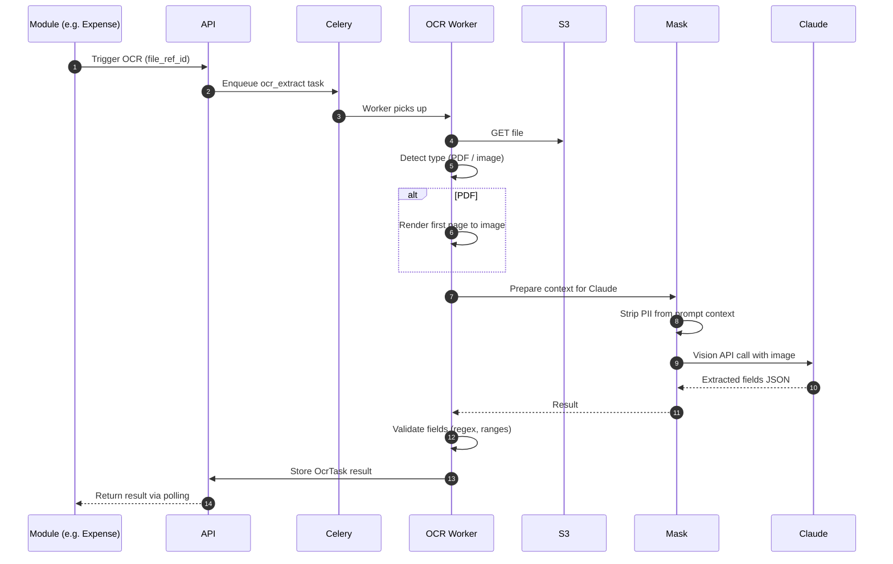

# Shared Capability — OCR Pipeline

Extracts structured fields from uploaded invoice/bill files using Claude Vision API.

## Sequence



## Component Architecture

```mermaid
flowchart LR
    Upload[File upload] --> Detect[Type detector]
    Detect --> Convert[PDF→image converter<br/>pdf2image]
    Convert --> Prep[Image preprocessor<br/>resize, contrast]
    Prep --> Mask[Mask service]
    Mask --> Claude[Claude Vision API]
    Claude --> Parser[Response parser]
    Parser --> Validator[Field validator]
    Validator --> Confidence[Per-field confidence score]
    Confidence --> Store[OcrTask + OcrResult tables]

    classDef proc fill:#e8f5e9,stroke:#388e3c
    classDef ai fill:#fce4ec,stroke:#c2185b
    class Detect,Convert,Prep,Parser,Validator proc
    class Mask,Claude ai
```



## Output Schema

```json
{
  "vendor_name": {"value": "XYZ Logistics", "confidence": 0.97},
  "invoice_number": {"value": "INV-2026-042", "confidence": 0.99},
  "invoice_date": {"value": "2026-04-08", "confidence": 0.95},
  "amount_total": {"value": 250000.00, "confidence": 0.92},
  "amount_pre_gst": {"value": 211864.41, "confidence": 0.88},
  "gst_amount": {"value": 38135.59, "confidence": 0.88},
  "gstin": {"value": "29ABCDE1234F1Z5", "confidence": 0.95},
  "line_items": [...],
  "currency": {"value": "INR", "confidence": 1.0}
}
```

Fields with confidence < 0.85 are highlighted in the UI for user verification.

## Edge Cases

| Scenario | Handling |
|---|---|
| Multi-page PDF | Process page 1 only by default; user can flag "multi-page invoice" to process all |
| Handwritten | Lower confidence; surface to L1 for verification |
| Foreign language | Detect language, request structured fields anyway |
| Image rotated | Auto-rotate before send via PIL |
| Stamps/signatures over text | Best effort, lower confidence |
| Scanned at low DPI | Warn if image dimensions < 1000px |
