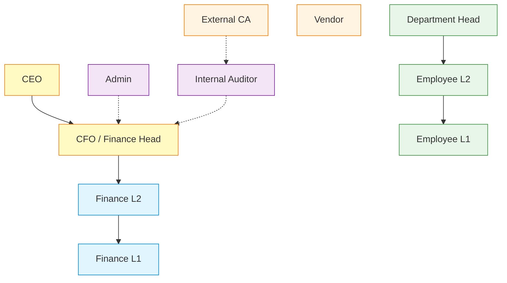
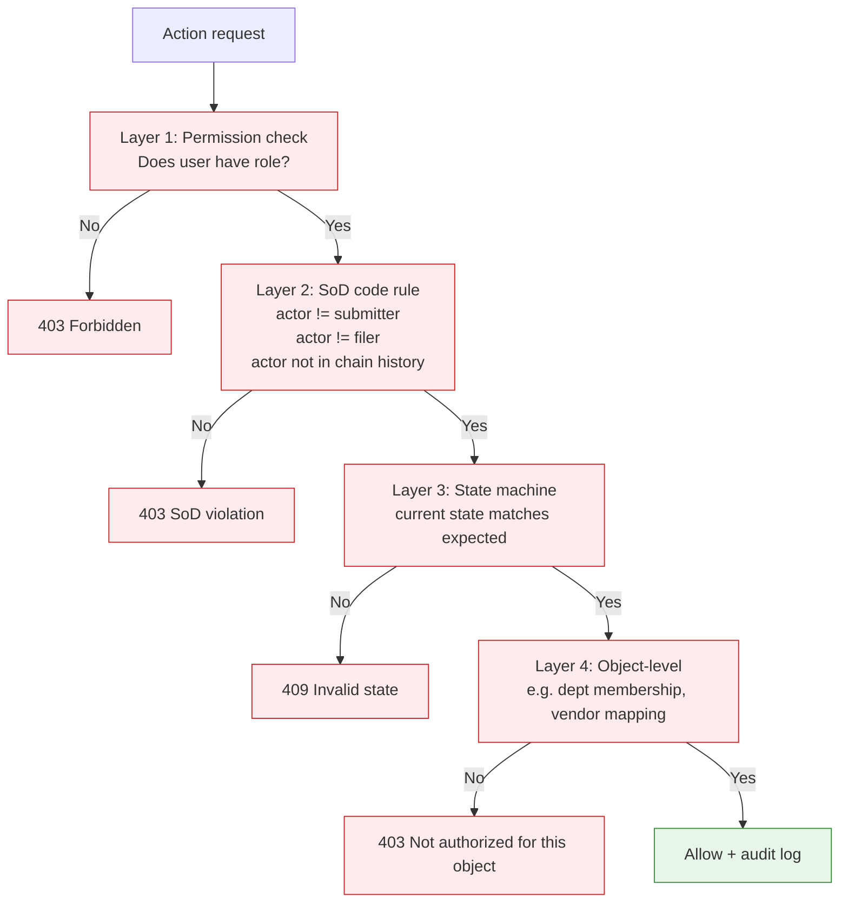
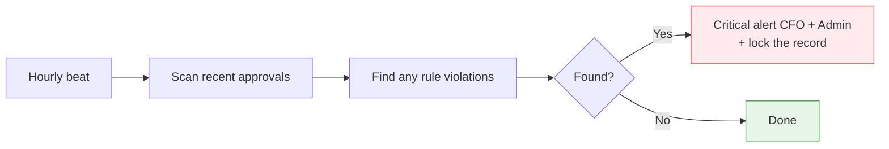

# Shared Capability — RBAC & SoD

Role-based access control with hard-coded Segregation of Duties enforcement.

## Role Hierarchy

## Permission Matrix (Excerpt)

| Permission | Vendor | EmpL1 | EmpL2 | HoD | FinL1 | FinL2 | CFO | CEO | Admin | Auditor |
|---|---|---|---|---|---|---|---|---|---|---|
| Submit own bill | ✅ | — | — | — | — | — | — | — | — | — |
| File bill on behalf | — | ✅ | — | — | — | — | — | — | — | — |
| Approve at L1 | — | ✅ | — | — | — | — | — | — | — | — |
| Approve at L2 | — | — | ✅ | — | — | — | — | — | — | — |
| Approve at HoD | — | — | — | ✅ | — | — | — | — | — | — |
| Approve at Fin L1 | — | — | — | — | ✅ | — | — | — | — | — |
| Approve at Fin L2 | — | — | — | — | — | ✅ | — | — | — | — |
| Approve at Fin Head | — | — | — | — | — | — | ✅ | — | — | — |
| Book in D365 | — | — | — | — | — | — | ✅ | — | — | — |
| Create vendor | — | — | — | — | — | — | — | — | ✅ | — |
| Approve vendor | — | — | — | — | — | — | ✅ | — | ✅ | — |
| Lock budget | — | — | — | — | — | — | ✅ | — | — | — |
| Approve BRR (intra-dept) | — | — | — | ✅ | — | — | ✅ | — | — | — |
| Approve BRR (inter-dept) | — | — | — | — | — | — | ✅ | ✅ | — | — |
| View audit log | — | — | — | — | — | — | ✅ | ✅ | ✅ | ✅ |
| Export audit log | — | — | — | — | — | — | ✅ | — | — | ✅ |
| Manage users | — | — | — | — | — | — | — | — | ✅ | — |
| Override anomaly | — | ✅ | ✅ | ✅ | ✅ | ✅ | ✅ | — | — | — |

## SoD Enforcement (Cascade)

## Hard-Coded SoD Rules

These cannot be configured. They are enforced in `apps/approvals/sod.py`:

1. **No self-approval** — `actor.id != target.submitter.id`
2. **No double-approval** — `actor.id not in target.approval_history`
3. **No vendor-as-approver** — `actor.role != Vendor`
4. **No admin financial approval** — `actor.role != Admin` for money-flow transitions
5. **No filer-on-behalf as L1 validator** — if `target.filer_on_behalf == actor`, route to backup L1
6. **No delegate already in chain** — if delegate previously approved this chain, auto-skip
7. **CFO cannot approve their own expense** — even though they're at the top of the chain
8. **Reviewer cannot review own audit findings** — internal auditor cannot self-clear

## SoD Violation Detection (Continuous)

The SoD scanner runs hourly to catch any violations that slipped through (e.g., due to race conditions or schema changes):

## Backup Approver Configuration

Each role has a configurable backup. When the primary is unavailable (deactivated, on leave, in conflict), the backup is auto-routed:

| Primary | Backup |
|---|---|
| L1 mapped to vendor | Backup L1 (admin-configured) |
| HoD on leave | Backup HoD (configurable) |
| CFO unreachable for >24h on critical | CEO (escalation) |

The backup also obeys SoD — it gets the same checks as the primary.
