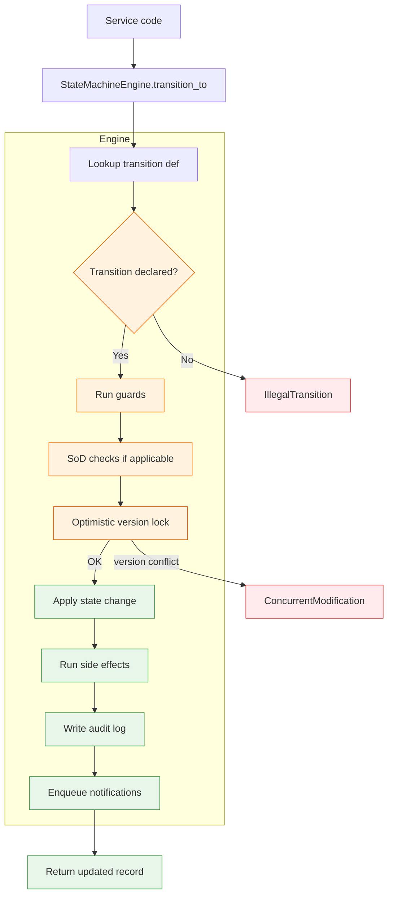
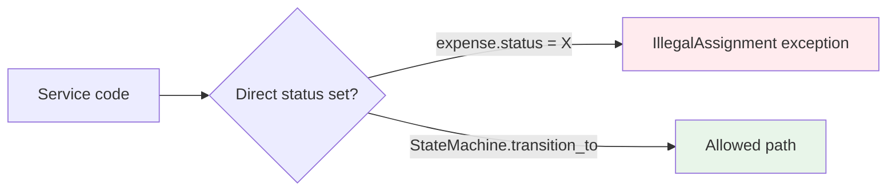
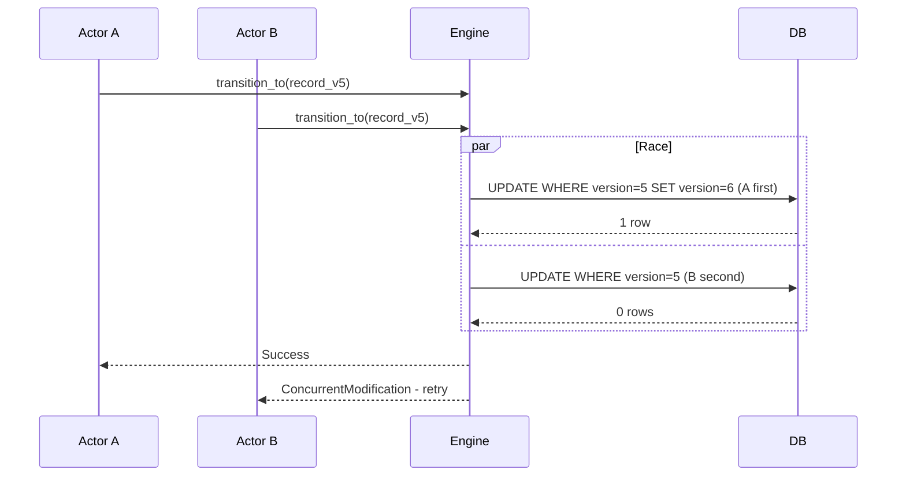
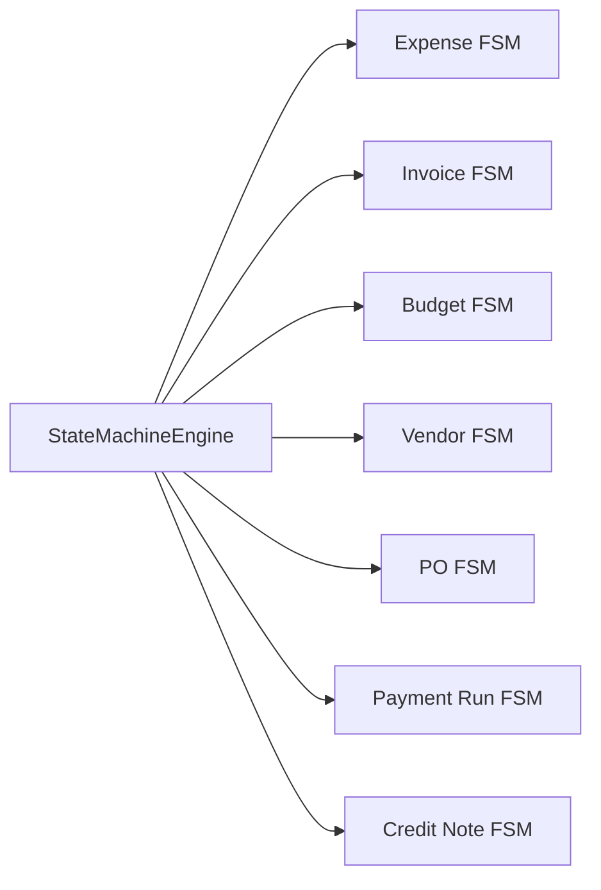

# Shared Capability — State Machine Framework

A generic state machine library used by every module with stateful records (Expense, Invoice, Budget, Vendor, AP).

## Core Concept

Each stateful model declares:
1. A set of states
2. A set of legal transitions (from → to)
3. Per-transition guards (preconditions)
4. Per-transition side effects (post-actions)

The framework enforces:
- Only declared transitions are allowed
- Direct status assignment is forbidden
- Every transition is audit-logged
- Optimistic concurrency via version field

## Architecture



## Declaring a State Machine

Pseudo-Python pattern (each module declares its own):

```python
class ExpenseStateMachine(StateMachine):
    states = [
        "DRAFT", "SUBMITTED", "AUTO_REJECT", "WITHDRAWN",
        "PENDING_L1", "QUERY_L1",
        "PENDING_L2", "QUERY_L2",
        "PENDING_HOD", "QUERY_HOD",
        "PENDING_FIN_L1", "QUERY_FIN_L1",
        "PENDING_FIN_L2", "QUERY_FIN_L2",
        "PENDING_FIN_HEAD", "QUERY_FIN_HEAD",
        "APPROVED", "PENDING_D365", "BOOKED_D365",
        "POSTED_D365", "PAID", "REJECTED", "EXPIRED",
    ]
    
    transitions = [
        ("SUBMITTED", "PENDING_L1", on_anomaly_clean),
        ("SUBMITTED", "AUTO_REJECT", on_hard_duplicate),
        ("PENDING_L1", "PENDING_L2", on_l1_approve),
        ("PENDING_L1", "REJECTED", on_l1_reject),
        # ... etc
    ]
```

## Key Properties

### 1. No Bypass



The model's `status` property has a setter that raises unless called from within the engine. This prevents accidental state corruption.

### 2. Version-Based Optimistic Lock



### 3. Reusable Across Modules



## Lifecycle Hooks

Each transition can declare:

| Hook | When | Use Case |
|---|---|---|
| `before_transition` | Pre-validation | Compute derived fields |
| `guard` | Validation | Check preconditions |
| `on_transition` | During | Apply side effects |
| `after_transition` | Post-commit | Send notifications, enqueue follow-ups |

## Audit Integration

Every successful transition automatically writes an audit log entry with:
- Module + record type
- From state, to state
- Actor
- Reason (if provided)
- Before/after snapshots
- Timestamp + IP

This is **not optional** — it happens inside the engine, not the caller. Calling code cannot accidentally skip the audit.

## Edge Cases the Framework Handles

| Case | Behavior |
|---|---|
| Null transition (X→X) | Rejected |
| Cyclic transitions | Allowed if explicitly declared |
| Terminal state | Engine raises if any further transition attempted |
| Missing guard return value | Treated as failure |
| Side effect throws | Transaction rolled back; record stays in original state |
| Concurrent transitions | First wins; second gets `ConcurrentModification` |
